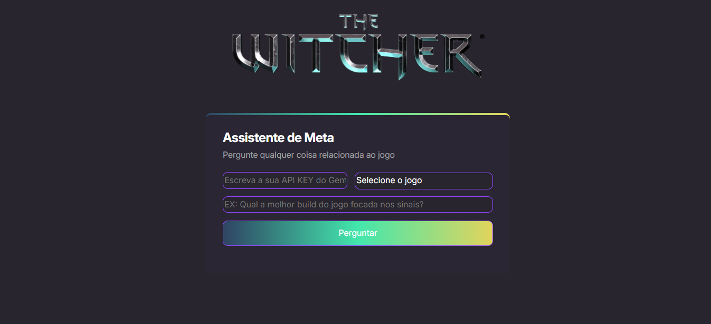
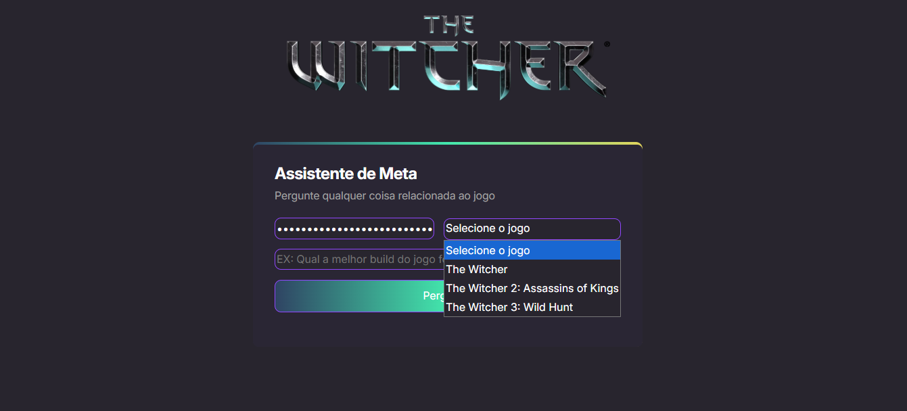
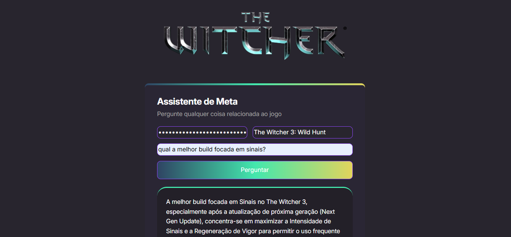

# GuIA The Witcher: Seu Assistente Inteligente para The Witcher

🚀 **Bem-vindo ao GuIA The Witcher!** Este projeto, desenvolvido durante a **NLW 20 da Rocketseat**, utiliza o poder do **Google Gemini API** para oferecer respostas instantâneas e personalizadas sobre o universo de The Witcher.

Desenvolvi este assistente para aprofundar meus conhecimentos em **Inteligência Artificial**, aprimorar minhas habilidades em **JavaScript**, **CSS** e **HTML**, e criar uma ferramenta útil para fãs dos jogos.

## ✨ O Que Ele Faz?

O GuIA The Witcher permite que você faça perguntas específicas sobre os jogos – desde dicas de jogabilidade, lore, até conselhos sobre personagens e quests. A IA do Google Gemini processa sua consulta e retorna informações relevantes, tornando sua experiência em The Witcher ainda mais rica.

## 💡 Como Funciona?

1.  Faça sua pergunta em linguagem natural sobre The Witcher(1, 2 ou 3).
2.  A aplicação envia a pergunta para a Google Gemini API.
3.  Receba uma resposta concisa e informativa gerada pela IA.

## 🛠️ Tecnologias Utilizadas
  * HTML5
  * CSS3
  * JavaScript
  * Google Gemini API 

## 🚀 Demonstração:

https://github.com/user-attachments/assets/b6d4d734-5ada-45c3-8a45-c8082075f58e

## 🚀 Screenshots:

## ✨ Link de acesso:
https://nlw-snowy.vercel.app/

## 💡 Inspiração e Evento

Este projeto foi desenvolvido como parte do evento **NLW 20 da Rocketseat**, uma iniciativa incrível que promove o aprendizado e a colaboração entre desenvolvedores. Agradeço à Rocketseat pela oportunidade e pelo conteúdo de alta qualidade.
